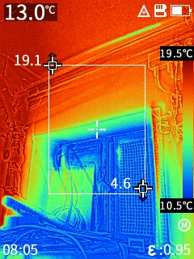
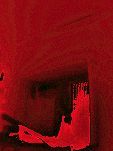
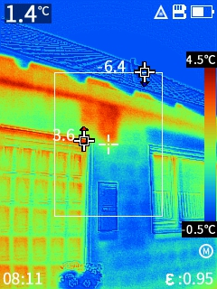
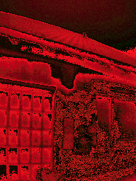

# Guide_PC210_ImageExtractor

This repo holds sample code to extract "hidden" content from Guide PC210 thermal camera.

The camera creates the `IR_` jpeg file with lots of data after the JPEG end mark.

There is 4 byte per pixel data for each of the 192\*256 pixels where only one of the bytes seem to hold IR image data.
The byte order does not seem constant, as for the different sample images you need to look at different bytes to get the thermal information.

Currently, the expected IR data is pushed to the red channel, the other channels display the other unkown data scaled by 8 so it doesn't affect the image but is visible in e.g. gimp.

Maybe somebody is up for analyzing this a bit further? :-)

After the pixel data there is a json blob with meta data.

## Update 2023-02-22:
I found out that the supposed-to-be-constant 4th byte actually belongs to the image data as well. Actually, it is kind of a 4-byte representation of the image data with some caveats:

From the second example image below:
```
            # b4 can be 0x40, 0x3E, 0x3F, 0x00, 0xBE, 0xBD, 0xBF, 0xC0, 0xC1
            # warm temperatures:
            # 0x3E: 0b0011 1110 62
            # 0x3F: 0b0011 1111 63
            # 0x40: 0b0100 0000 64 (warmer than 63)
            # 0x41: 0b0100 0001 65
            # (bd -> 3e are direct neighbours, also with 0?!)
            # cold temperatures:
            # 0xBD: 0b1011 1101 189
            # 0xBE: 0b1011 1110 190
            # 0xBF: 0b1011 1111 191
            # 0xC0: 0b1100 0000 192
            # 0xC1: 0b1100 0001 193 (colder than 192)

```
(this clearly looks like some kind of "scaled 2th complement" - within the 4th byte, the 3rd byte is fully valid as well.


## examples





